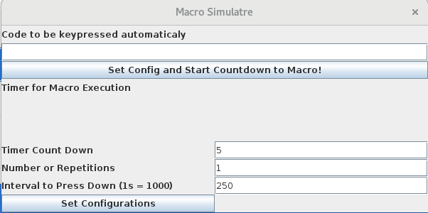
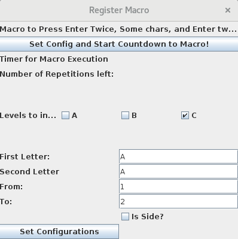
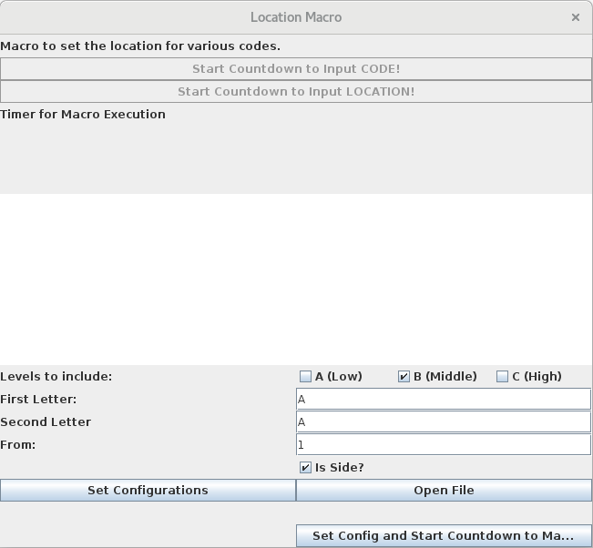

# Macro Simulate

Macro to simulate a keybord input of some numeric code.

# Register Simulate

Macro to simulate a register input into a system. With two <Enter>, the code and two <Enter> again.

# Location Simulate

Macro to input the location for products. A file is needed to get the product codes.

